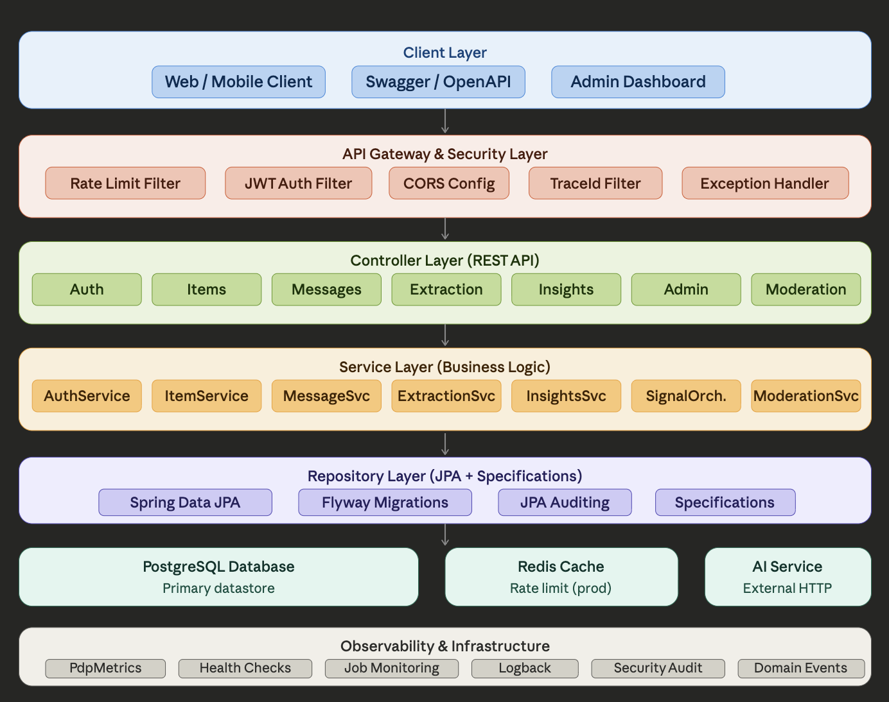

# Architecture Overview

## High-level shape
This is a Spring Boot monolith organized into clear layers:

1. **Web/API layer**: `@RestController` classes accept HTTP requests, validate input, and call services.
2. **Service layer**: business logic, orchestration, security checks, events, metrics, and auditing.
3. **Persistence layer**: Spring Data repositories + specifications for querying.
4. **Infrastructure**: security, rate limiting, tracing/logging, metrics, external API clients, jobs.
5. **Data layer**: PostgreSQL managed by Flyway migrations.





A typical request flow:

```
Client -> Filters (TraceId, JWT, RateLimit) -> Controller -> Service -> Repository -> DB
                                              |-> Metrics/Audit/Event
```

## Multi-project system view

The platform is split across three connected codebases:

1. **Core API (this repo)**: the source of truth for users, messages, signals, insights, and auth.
2. **PDP UI (`pdp-ui`)**: React frontend consuming the core API.
3. **PDP AI Signals (`pdp-ai-signals`)**: stateless microservice that performs AI extraction and returns structured JSON back to the core API.

Data flow across projects:

```
User -> PDP UI -> Core API -> AI Signals -> Core API -> DB -> UI
```

## Major subsystems

- **Auth & Security**: JWT access tokens, refresh tokens, user roles, configurable account lockouts, security auditing.
- **Messages & Signals**: user messages are collected and analyzed via AI extraction, then normalized into signals and metrics.
- **Insights**: aggregates daily behavior metrics into timeline and summary insights.
- **Jobs**: background jobs for processing, normalization, test data seeding, cleanup.
- **Observability**: trace IDs, structured logging, MDC-aware async audit logging, micrometer metrics, health endpoints.

## External integrations

- **AI Extraction**: HTTP client to an external AI extraction service (`pdp.ai.extraction.*` in config).
- **Prometheus/Grafana**: metrics via Micrometer and `/actuator/prometheus`.
- **OpenTelemetry**: exporter settings are env-driven and can stay disabled in local/dev.

## Data model overview

- **Core user data**: users, roles, refresh tokens.
- **User messages**: raw user input, processing status, analysis results.
- **Signals & normalization**: normalized entities (tone, intent, topics, etc.) and daily metrics.
- **Insights**: derived from daily behavior metrics.
- **Security audit logs**: independent audit table for security events.
- **Business event logs**: independent audit table for product/ops events.

## Runtime configuration

Runtime behavior is controlled by `application.yml`:

- Database config
- JWT settings (secret + access token TTL)
- Redis and rate-limit settings
- Lockout settings
- Job scheduling and batch sizes
- Extraction provider model
- Logging levels
- Actuator exposure
